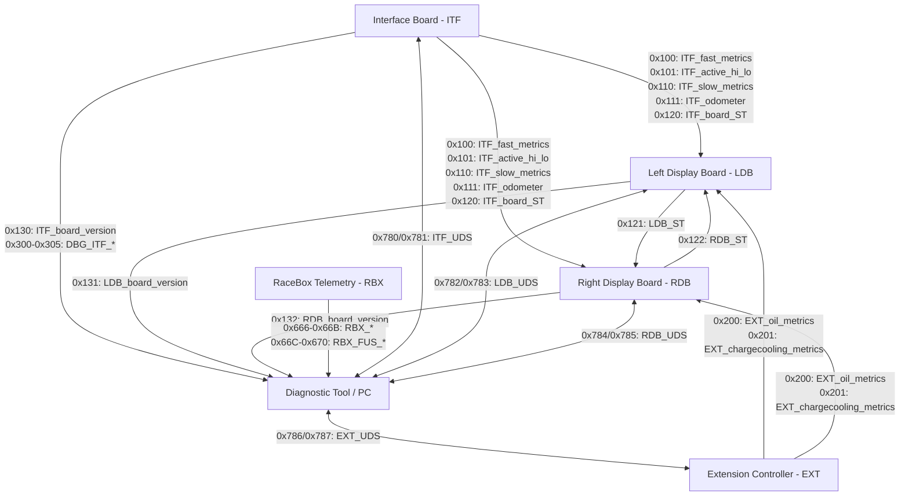

# Binocan CAN Protocol — Theory of Operation

## 1. Protocol Architecture & DBC Definition

The **Binocan** protocol defines all CAN bus communications between the Interface Board (ITF), Left Display Board (LDB), Right Display Board (RDB), Extension Controller (EXT), RaceBox telemetry module (RBX), and diagnostic tools. The canonical network database is maintained in [`binocan.dbc`](binocan.dbc).

---

## 2. Message Dictionary & Timing

All cycle times and send types conform strictly to [`binocan.dbc`](binocan.dbc).

### 2.1 Core Cluster & Operational Messages

| Message Name | CAN ID (Hex) | CAN ID (Dec) | Transmitter | Periodicity | Send Type | Key Signals |
| :--- | :--- | :--- | :--- | :--- | :--- | :--- |
| **`ITF_fast_metrics`** | `0x100` | 256 | ITF | 25 ms (40 Hz) | Cyclic | Speed (`ITF_speed_kph`), Engine RPM (`ITF_rpm`), Gear Position (`ITF_gear_position_ST`) |
| **`ITF_active_hi_lo`** | `0x101` | 257 | ITF | 200 ms (5 Hz) | Cyclic & On Request | Digital telltales & inputs (turn signals, high beams, oil pressure, coolant low/overtemp, fuel low, brake low, handbrake, door, CEL, airbag, ABS, backlight, ignition, alarm, button) |
| **`ITF_slow_metrics`** | `0x110` | 272 | ITF | 500 ms (2 Hz) | Cyclic | Coolant temperature (`ITF_coolant_temp`), fuel level percentage (`ITF_fuel_level_pc`), 12V battery voltage (`ITF_lv_voltage_v`) |
| **`ITF_odometer`** | `0x111` | 273 | ITF | 250 ms (4 Hz) | Cyclic | Total odometer (`ITF_odometer_km` + `ITF_odo_rem_m`), trip odometer (`ITF_trip_km` + `ITF_trip_rem_m`) |
| **`ITF_board_ST`** | `0x120` | 288 | ITF | 200 ms (5 Hz) | Cyclic | System status (`ITF_SM_ST`), MCU temperature (`ITF_MCU_temp`), 5V / 5V AUX rail health, display alive flags (`ITF_LD/RD_check_alive_ST`), ADC/expander status |
| **`LDB_ST`** | `0x121` | 289 | LDB | 200 ms (5 Hz) | Cyclic | Left display status (`LDB_SM_ST`), brightness (light/dark), mode lock, light mode |
| **`RDB_ST`** | `0x122` | 290 | RDB | 200 ms (5 Hz) | Cyclic | Right display status (`RDB_SM_ST`), brightness (light/dark), mode lock, light mode |
| **`ITF_board_version`** | `0x130` | 304 | ITF | 1000 ms (1 Hz) | Cyclic | Interface Board firmware version (major, minor, patch, dirty flag, git commit hash) |
| **`LDB_board_version`** | `0x131` | 305 | LDB | 1000 ms (1 Hz) | Cyclic | Left Display Board firmware version (major, minor, patch, dirty flag, git commit hash) |
| **`RDB_board_version`** | `0x132` | 306 | RDB | 1000 ms (1 Hz) | Cyclic | Right Display Board firmware version (major, minor, patch, dirty flag, git commit hash) |

### 2.2 Extension Controller Messages

| Message Name | CAN ID (Hex) | CAN ID (Dec) | Transmitter | Periodicity | Send Type | Key Signals |
| :--- | :--- | :--- | :--- | :--- | :--- | :--- |
| **`EXT_oil_metrics`** | `0x200` | 512 | EXT | 100 ms (10 Hz) | Cyclic | Signal validity bitmask, oil pressure (`EXT_oil_pressure`), oil temperature (`EXT_oil_temperature`) |
| **`EXT_chargecooling_metrics`** | `0x201` | 513 | EXT | 100 ms (10 Hz) | Cyclic | Signal validity bitmask, intercooler coolant temp in (`EXT_charge_coolant_temp_in`), temp out (`EXT_charge_coolant_temp_out`) |

### 2.3 Interface Board Debug Messages

| Message Name | CAN ID (Hex) | CAN ID (Dec) | Transmitter | Periodicity | Send Type | Key Signals |
| :--- | :--- | :--- | :--- | :--- | :--- | :--- |
| **`DBG_ITF_speed`** | `0x300` | 768 | ITF | 25 ms (40 Hz) | Cyclic | Speed sensor pulse frequency (`DBG_speed_freq`) and duty cycle (`DBG_speed_duty`) |
| **`DBG_ITF_RPM`** | `0x301` | 769 | ITF | 25 ms (40 Hz) | Cyclic | RPM sensor pulse frequency (`DBG_RPM_freq`) and duty cycle (`DBG_RPM_duty`) |
| **`DBG_ITF_coolant`** | `0x302` | 770 | ITF | 100 ms (10 Hz) | Cyclic | Coolant gauge signal frequency (`DBG_coolant_freq`) and duty cycle (`DBG_coolant_duty`) |
| **`DBG_ITF_ADC_raw`** | `0x303` | 771 | ITF | 100 ms (10 Hz) | Cyclic | Raw ADC voltages: 3.3V rail (`DBG_3V3_raw_v`), 12V rail (`DBG_12V_raw_v`) |
| **`DBG_ITF_pulse_counts`** | `0x304` | 772 | ITF | 100 ms (10 Hz) | Cyclic | Raw accumulator pulse counts: `DBG_RPM_pulses`, `DBG_speed_pulses` |
| **`DBG_ITF_fuel`** | `0x305` | 773 | ITF | 200 ms (5 Hz) | Cyclic | Fuel sensor voltage (`DBG_fuel_raw_v`), unfiltered level (`DBG_fuel_level_unfiltered`), sensor resistance (`DBG_fuel_r`, `DBG_fuel_full_r`) |

### 2.4 RaceBox Companion Telemetry

| Message Name | CAN ID (Hex) | CAN ID (Dec) | Transmitter | Periodicity | Send Type | Key Signals |
| :--- | :--- | :--- | :--- | :--- | :--- | :--- |
| **`RBX_SPEED_HEADING`** | `0x666` | 1638 | RBX | 40 ms (25 Hz) | Cyclic | GPS speed (`RBX_speed_kph`), course heading, accuracy, fix status, satellites |
| **`RBX_LAT_LON`** | `0x667` | 1639 | RBX | 40 ms (25 Hz) | Cyclic | High-precision WGS84 latitude (`RBX_latitude_deg`) and longitude (`RBX_longitude_deg`) |
| **`RBX_ALT_ACCURACY`** | `0x668` | 1640 | RBX | 40 ms (25 Hz) | Cyclic | MSL altitude (`RBX_msl_altitude_m`), horizontal accuracy, PDOP |
| **`RBX_IMU_ACCEL`** | `0x669` | 1641 | RBX | 40 ms (25 Hz) | Cyclic | 3-axis accelerometer (`RBX_accel_X/Y/Z_g`), battery %, charging status, rolling counter |
| **`RBX_IMU_GYRO`** | `0x66A` | 1642 | RBX | 40 ms (25 Hz) | Cyclic | 3-axis gyroscope rotation rates (`RBX_rot_rate_X/Y/Z` in deg/s) |
| **`RBX_UTC_TIME`** | `0x66B` | 1643 | RBX | 40 ms (25 Hz) | Cyclic | GPS UTC date (year, month, day) and time (hour, minute, second, centisecond) |
| **`RBX_FUS_STATE`** | `0x66C` | 1644 | RBX | 200 ms (5 Hz) | Cyclic | Fusion alignment state (`RBX_fus_state_ST`), leveling source, validity flags, confidences (`RBX_fus_*_confidence_pc`), rolling counter shared with `RBX_IMU_ACCEL` |
| **`RBX_FUS_KINEMATICS`** | `0x66D` | 1645 | RBX | 40 ms (25 Hz) | Cyclic | Filtered speed (`RBX_fus_speed_kph`), heading of motion, heading rate (clockwise positive), GNSS longitudinal acceleration |
| **`RBX_FUS_ACCEL_VEH`** | `0x66E` | 1646 | RBX | 40 ms (25 Hz) | Cyclic | Vehicle-frame specific force (`RBX_fus_accel_X/Y/Z_g`, X forward, Y left, Z up) and learned gravity norm |
| **`RBX_FUS_GYRO_VEH`** | `0x66F` | 1647 | RBX | 40 ms (25 Hz) | Cyclic | Bias-corrected vehicle-frame rates (`RBX_fus_rot_rate_X/Y/Z`, yaw positive left) and yaw 1-sigma (655.35 = unknown) |
| **`RBX_FUS_MOUNT`** | `0x670` | 1648 | RBX | 200 ms (5 Hz) | Cyclic | Mounting roll/pitch/yaw (`RBX_fus_mount_*_deg`), accelerometer gain (0 = unknown), cornering-axis error (255 = not enough turns) |

The `RBX_FUS_*` frames are optional: the RaceBox companion only transmits them when its fusion stage is enabled. Periodicities above are the companion's Kconfig defaults and can be changed or disabled per message. The canonical source for the companion frames is mirrored in [`racebox_companion.dbc`](racebox_companion.dbc), which uses the `RB_*` naming of the RaceBoxCompanion project; [`binocan.dbc`](binocan.dbc) carries the same layouts with `RBX_*` names.

### 2.5 UDS Diagnostics (ISO 14229 / ISO 15765-2)

| Message Name | CAN ID (Hex) | CAN ID (Dec) | Transmitter | Periodicity | Send Type | Key Signals |
| :--- | :--- | :--- | :--- | :--- | :--- | :--- |
| **`ITF_UDS_REQ`** | `0x780` | 1920 | Tester / External | Aperiodic | SendOnRequest | ITF UDS request payload (`ITF_uds_req`) |
| **`ITF_UDS_RESP`** | `0x781` | 1921 | ITF | Aperiodic | SendOnRequest | ITF UDS response payload (`ITF_uds_resp`) |
| **`LDB_UDS_REQ`** | `0x782` | 1922 | ITF / Tester | Aperiodic | SendOnRequest | LDB UDS request payload (`LDB_uds_req`) |
| **`LDB_UDS_RESP`** | `0x783` | 1923 | LDB | Aperiodic | SendOnRequest | LDB UDS response payload (`LDB_uds_resp`) |
| **`RDB_UDS_REQ`** | `0x784` | 1924 | ITF / Tester | Aperiodic | SendOnRequest | RDB UDS request payload (`RDB_uds_req`) |
| **`RDB_UDS_RESP`** | `0x785` | 1925 | RDB | Aperiodic | SendOnRequest | RDB UDS response payload (`RDB_uds_resp`) |
| **`EXT_UDS_REQ`** | `0x786` | 1926 | ITF / Tester | Aperiodic | SendOnRequest | EXT UDS request payload (`EXT_uds_req`) |
| **`EXT_UDS_RESP`** | `0x787` | 1927 | EXT | Aperiodic | SendOnRequest | EXT UDS response payload (`EXT_uds_resp`) |

---

## 3. C Binding Generation

The generated C bindings (`binocan.c` and `binocan.h`) provide pack/unpack routines with integer scaling, endianness normalization, and physical encode/decode helper functions:
- **Core messages**:
  - `binocan_itf_fast_metrics_pack()` / `binocan_itf_fast_metrics_unpack()`
  - `binocan_itf_active_hi_lo_pack()` / `binocan_itf_active_hi_lo_unpack()`
  - `binocan_itf_slow_metrics_pack()` / `binocan_itf_slow_metrics_unpack()`
  - `binocan_itf_odometer_pack()` / `binocan_itf_odometer_unpack()`
  - `binocan_itf_board_st_pack()` / `binocan_itf_board_st_unpack()`
  - `binocan_itf_board_version_pack()` / `binocan_itf_board_version_unpack()`
- **Display status & version messages**:
  - `binocan_ldb_st_*`, `binocan_rdb_st_*`
  - `binocan_ldb_board_version_*`, `binocan_rdb_board_version_*`
- **External controller messages**:
  - `binocan_ext_oil_metrics_*`, `binocan_ext_chargecooling_metrics_*`
- **Debug & telemetry messages**:
  - `binocan_dbg_itf_*_pack()` / `binocan_dbg_itf_*_unpack()`
  - `binocan_rbx_*_pack()` / `binocan_rbx_*_unpack()`
- **UDS frames**:
  - `binocan_*_uds_*_pack()` / `binocan_*_uds_*_unpack()`
